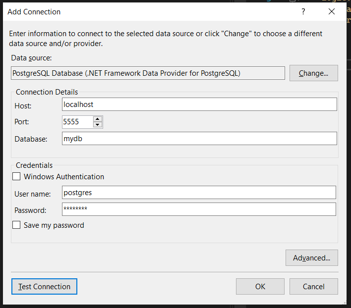

# Integration Tests With Test Containers

Integration Tests With WebApplicationFactory and Test Containers

Code for blog post - https://carlpaton.github.io/2022/07/integration-tests-with-webapplicationfactory-testcontainers/

## Source Code

* CustomerApi                  -> MVC Web API (with controllers)
* CustomerApi.IntegrationTests -> xUnit Test Project for the API

## Database

The CustomerApi uses a [postgres](https://hub.docker.com/_/postgres/) database, you can spin it up locally with the following docker command.

```
docker run --name CustomerApiDatabase -p 5555:5432 -e POSTGRES_DB=mydb -e POSTGRE_USER=postgres -e POSTGRES_PASSWORD=password -d postgres:14.4
```

The connection string would then be `Server=localhost;Port=5555;Database=mydb;User ID=foo;Password=64d15593-6160-43de-9d46-f80e71cec08b`

This is just for local testing, secrets should be securely injected in production - but you knew that right :D

To connect to the database using VS2022 you can use the plugin [NpgsqlPostgreSQLIntegration](https://marketplace.visualstudio.com/items?itemName=RojanskyS.NpgsqlPostgreSQLIntegration), I installed it from `Extensions` -> `Manage Extensions` -> `Visual Studio Marketplace`. It then installs with a VSIX installer (whatever that is). You then go `tools` -> `Connect to Database` -> `PostgreSQL Database`

